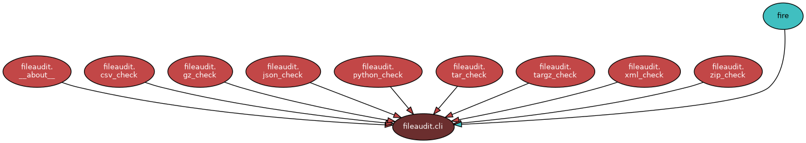

# Architecture Overview

Good security software, especially open-source security software, **should** have a written architecture document. Having an architecture document is vital from a security perspective.

An architecture document:

* Helps developers **understand** how and where to make changes, whether they are new to a project or not.  
* Has a strong emphasis on the ‘**what**’ and provides boundaries for the ‘**how**’ (the implementation). A detailed implementation description is not part of the architecture document.

Within the IT industry, there is continuous debate about what architecture is and what a design is. Being a TOGAF certified practitioner myself, I like to keep things simple and always make sure that the purpose of any document is clear. Therefore, this document is **not a** detailed design; instead, it covers crucial architecture and design decisions that steer the implementation. 

In my opinion, open-source software for security **SHOULD** have an open architecture document. This architecture is:

* **Available to** everyone. This architecture document is part of the FOSS product, Python File Audit, and is released under a Creative Commons licence.  
* Part of an open process in which everyone can participate to improve the architecture. See section [CONTRIBUTE](../CONTRIBUTE.md).

If you are interested in learning more about architecture—and especially open architecture, see:
- [The Architecture Playbook](https://nocomplexity.com/documents/arplaybook/introduction.html) and
- [Open Architectures do not work: The need for real open Architectures](http://www.slideshare.net/maikelm/open-architectures-do-not-work-the-need-for-real-open-architectures). 

## High-Level Design

Python File Audit performs security validations on different types of files.

A dedicated validation checker is implemented for each supported file type.

During prototyping, validation can be performed either in a Jupyter Notebook using one of the available APIs, or through the CLI.

## Architecture Principles

Python File Audit is built using the following guiding principles:

* **Separation of concerns**: Functionality for validation is separated. This to make maintenance simple and each module more easily to extend and test!

* **Simple to use:** Python File Audit is designed for ease of use by anyone, regardless of experience level.  

* **Simple to extend:** The program must be easy to adapt and build upon for future needs. You can overload existing methods if needed for a special use-case. A Python decorator can be extended, parameterized, stacked, or designed with multiple behaviours (a form of overloading its usage/interface).

* **Simple to maintain:** We follow [0Complexity design principles](https://nocomplexity.com/documents/0complexity/abstract.html). E.g. simplicity enhances security. This means minimising dependencies and keeping both design and implementation straightforward and transparent.  
* **Transparent:** All code is released under the FOSS (Free and Open Source Software) [GPLv3 licence](https://nocomplexity.com/documents/codeaudit/license.html). Transparency builds trust.  
* **Clear scope:** No tool can do everything well, so we make strong, opinionated choices regarding the functionality we support.

**Implications:**

:::{note}
We focus on delivering a simple, trustworthy security library that performs its defined tasks exceptionally well—without compromise.
:::

## Design Choices

The following design choices have been made for Python File Audit:

* **No TLS checking**  
  * **Rationale:**
  1. Checking TLS headers and other crucial HTTPS attributes is highly complex and dynamic. This module only accept valid HTTPS calls.

+++

* **No remote Python File validation option**
    * **Rationale:**
    * For scanning Python code on weakness you SHOULD use [Python Code Audit](https://github.com/nocomplexity/codeaudit). This great SAST application offers various APIs for creating remote validation on remote Python files. [Python Code Audit](https://github.com/nocomplexity/codeaudit) makes use of this security module.

## Use of AI 

I love new technology. I also advocate for Free and Open Machine Learning/AI. I think FOSS AI/ML is crucial for everyone. See [FOSS AI/ML Guide](https://nocomplexity.com/documents/fossml/abstract.html).

AI/Machine learning is an exciting and powerful technology. The continuous use and growth of AI and machine learning technology opens new opportunities. It also enables opportunities for solving complex problems in a more simple way.

For Python File Audit we make use of AI/ML capabilities in a secure, safe and most ethical way possible. 
However every code line is reviewed in depth by a human and often improved, since most AI code generators fail when it comes to create secure Python software.

Truth is: Most AI tools turned out to be of limited value for real trustworthy cybersecurity aspects. Human knowledge work, especially on design and security aspects is currently still vital for developing and maintaining a trustworthy Python security code analyzer!

## Why this library

Python applications are not **secure by default**, and building secure software is rarely simple. Even when leveraging AI, generated code often remains vulnerable because security is an architectural and design discipline, not just a matter of writing code.

Processing malicious files in Python applications can lead to severe security consequences. Files received from external applications must always be validated prior to use. This aligns directly with the core [security-by-design](https://nocomplexity.github.io/securitybydesign/) principle: *never trust, always verify*.

By providing a straightforward, general-purpose Python library to validate various file types against common security risks, we can make applications secure by default.

Currently, due to the lack of a simple file-validation library, many developers either build their own custom validation layer or omit safety checks entirely.